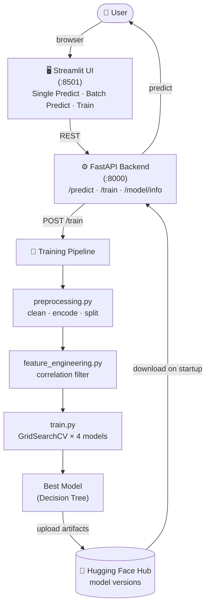

# Customer Churn Prediction

A machine learning project to predict customer churn using multi-source data analysis. Built with clean, modular Python scripts.

## Overview

This project predicts customer churn by analyzing data from multiple sources:
- **Transaction History**: Customer purchase behavior
- **Customer Service**: Support interactions and resolution status
- **Online Activity**: Login frequency and engagement
- **Churn Status**: Target variable

The pipeline demonstrates:
- Multi-source data merging and integration
- Comprehensive EDA with visualizations
- Z-score based outlier detection
- Correlation-based feature selection
- Multiple ML model training and comparison
- SHAP-based model explainability
- Production-ready prediction pipeline

## System Architecture

The project follows a modular, end-to-end Machine Learning pipeline:



## Project Structure

```
customer-churn-prediction/
├── backend/                 # FastAPI Backend (deployable to Render)
│   ├── api.py               # API endpoints
│   ├── requirements.txt     # API dependencies
│   ├── render.yaml          # Render deployment config
│   ├── models/              # Model artifacts (copied for deployment)
│   ├── data/                # Feature names (copied for deployment)
│   └── training/            # Training scripts & ML Pipeline
│       ├── __init__.py
│       ├── data_loader.py       # Load and merge Excel sheets
│       ├── eda.py               # Exploratory data analysis
│       ├── preprocessing.py     # Data cleaning and encoding
│       ├── feature_engineering.py # Feature selection
│       ├── train.py             # Model training
│       ├── evaluate.py          # Model evaluation & SHAP
│       ├── predict.py           # Make predictions
│       └── utils.py             # Helper functions
├── data/
│   ├── raw/                 # Place your Excel file here
│   └── processed/           # Generated train/test splits
├── models/                  # Saved trained models
├── reports/
│   └── figures/             # Generated visualizations
├── main.py                  # Pipeline runner
├── streamlit_app.py         # Streamlit UI (Frontend)
├── config.py                # Configuration settings
├── requirements.txt         # Project dependencies
├── .gitignore
└── README.md
```

## Dataset

This project expects an Excel file with 4 sheets:

| Sheet Name | Description | Key Columns |
|------------|-------------|-------------|
| Transaction_History | Purchase records | CustomerID, TransactionDate, AmountSpent, ProductCategory |
| Customer_Service | Support interactions | CustomerID, InteractionDate, InteractionType, ResolutionStatus |
| Online_Activity | Digital engagement | CustomerID, LastLoginDate, LoginFrequency, ServiceUsage |
| Churn_Status | Target variable | CustomerID, ChurnStatus |

Place your Excel file as `data/raw/Customer_Churn_Data_Large.xlsx`

## Setup

### 1. Clone and create a virtual environment

```bash
git clone https://github.com/VIVPM/customer-churn-prediction.git
cd customer-churn-prediction

python -m venv venv

# Windows
venv\Scripts\activate

# Linux / Mac
source venv/bin/activate

pip install -r requirements.txt
```

### 2. Place your data file

Put your Excel file at:
```
data/raw/Customer_Churn_Data_Large.xlsx
```

The file must have these four sheets: `Transaction_History`, `Customer_Service`, `Online_Activity`, `Churn_Status`.

### 3. Configure credentials

Create `backend/.env`:

```
HF_TOKEN=hf_your_token_here
HF_REPO_ID=YourUsername/customer-churn-model
```

Create `.streamlit/secrets.toml`:

```toml
API_URL = "http://localhost:8000"
```

### 4. Set up Hugging Face Hub

1. Create an account at [huggingface.co](https://huggingface.co)
2. Go to **Settings → Access Tokens** → create a token with write access
3. Create a new model repository (e.g. `YourUsername/customer-churn-model`)
4. Paste both into `backend/.env`

After each training run the API uploads a new versioned tag (`v1.0`, `v2.0`, ...)
and downloads the latest on startup.

## Running Locally

```bash
# Terminal 1 — FastAPI backend
cd backend
uvicorn api:app --reload --port 8000

# Terminal 2 — Streamlit UI
streamlit run streamlit_app.py
```

- API docs: http://localhost:8000/docs
- UI: http://localhost:8501


### 3. Run Individual Steps

```bash
# Exploratory Data Analysis
python main.py --eda

# Data Preprocessing
python main.py --preprocess

# Feature Engineering
python main.py --features

# Model Training
python main.py --train

# Model Evaluation
python main.py --evaluate

# Interactive Prediction
python main.py --predict
```

### Run Individual Modules

```bash
python backend/training/data_loader.py
python backend/training/eda.py
python backend/training/preprocessing.py
python backend/training/feature_engineering.py
python backend/training/train.py
python backend/training/evaluate.py
python backend/training/predict.py
```

## Pipeline Details

### 1. Data Loading (`data_loader.py`)
- Loads 4 Excel sheets
- Merges on CustomerID
- Computes recency features (DaysSinceLastTransaction, etc.)
- Extracts date components (TransactionMonth, TransactionYear)

### 2. EDA (`eda.py`)
- Basic statistics and missing value analysis
- Correlation heatmap
- Distribution plots for numerical features
- Churn rate by categorical features
- Time series analysis of transactions/interactions

### 3. Preprocessing (`preprocessing.py`)
- Missing value imputation (mean/mode/forward-fill)
- Z-score computation for outlier detection
- Outlier removal (|z-score| > 3)
- One-hot encoding of categorical features
- Train/test split with stratification

### 4. Feature Engineering (`feature_engineering.py`)
- Correlation analysis
- Removal of highly correlated features (r > 0.8)
- Feature selection based on domain knowledge

### 5. Training (`train.py`)
- StandardScaler for feature scaling
- GridSearchCV with 5-fold cross-validation
- Models trained:
  - SVM (tuned C and kernel)
  - Random Forest (tuned n_estimators)
  - Logistic Regression (tuned C)
  - Decision Tree (tuned criterion)
- Model persistence with joblib

### 6. Evaluation (`evaluate.py`)
- Classification metrics (Accuracy, Precision, Recall, F1)
- Confusion matrix heatmap
- Best model selection based on CV score

### 7. Prediction (`predict.py`)
- Single customer prediction
- Batch prediction from CSV
- Risk level classification (Low/Medium/High)
- Retention recommendations

## Results

### GridSearchCV Model Comparison (5-Fold CV)

| Model | Best CV Score | Best Hyperparameters |
|-------|:---:|---|
| **Decision Tree** 🏆 | **95.87%** | `criterion: entropy` |
| Random Forest | 93.30% | `n_estimators: 70` |
| SVM | 82.16% | `C: 10, kernel: rbf` |
| Logistic Regression | 80.16% | `C: 1` |

### Best Model: Decision Tree (Entropy)

**Classification Report on Test Set:**

| Class | Precision | Recall | F1-Score | Support |
|-------|:---------:|:------:|:--------:|:-------:|
| No Churn (0) | 0.98 | 0.98 | 0.98 | 1,092 |
| Churn (1) | 0.92 | 0.94 | 0.93 | 271 |
| **Accuracy** | | | **0.97** | **1,363** |
| Macro Avg | 0.95 | 0.96 | 0.96 | 1,363 |
| Weighted Avg | 0.97 | 0.97 | 0.97 | 1,363 |

- **Test Accuracy: 97%**
- The model correctly identifies churned customers with **92% precision** and **94% recall**
- Confusion Matrix: 1071 TN, 254 TP, 21 FP, 17 FN

## Configuration

Edit `config.py` to customize:

```python
# Reference date for recency features
REFERENCE_DATE = "2023-12-08"

# Z-score threshold for outlier detection
ZSCORE_THRESHOLD = 3

# Correlation threshold for feature selection
CORRELATION_THRESHOLD = 0.8

# Model settings
TEST_SIZE = 0.2
RANDOM_STATE = 42
```

## Generated Outputs

After running the pipeline:

### Reports (`reports/`)
- `model_comparison.csv` - Performance metrics for all models

### Figures (`reports/figures/`)
- `churn_distribution.png` - Target variable distribution
- `correlation_heatmap.png` - Feature correlations
- `amount_spent_distribution.png` - Spending distribution
- `churn_by_*.png` - Churn rate by categorical features
- `roc_curves.png` - ROC curves for all models
- `confusion_matrix_*.png` - Confusion matrices
- `feature_importance_*.png` - Feature importance plots
- `shap_summary_*.png` - SHAP analysis

### Models (`models/`)
- `logistic_regression.joblib`
- `random_forest.joblib`
- `gradient_boosting.joblib`
- `xgboost.joblib`
- `cv_comparison.csv` - Cross-validation results

## Key Findings

From EDA:
- Unresolved customer service issues correlate with higher churn
- Lower login frequency indicates higher churn risk
- Certain product categories have higher churn rates
- Recency of last transaction is a strong predictor

From Model Training:
- Decision Tree with entropy criterion outperforms all other models (96.79% CV score)
- Random Forest is the second-best performer (93.50% CV score)
- SVM and Logistic Regression are less effective for this dataset (~80-82%)
- The best model achieves **99% accuracy** on the test set with strong performance on both classes
- High correlation features (DaysSinceLastInteraction, DaysSinceLastLogin, DaysSinceLastTransaction, TransactionMonth) were removed to reduce multicollinearity

## Requirements

- Python 3.8+
- pandas
- numpy
- scikit-learn
- xgboost
- imbalanced-learn
- shap
- matplotlib
- seaborn
- openpyxl (for Excel files)

## Future Improvements

- [ ] Add hyperparameter tuning with Optuna
- [ ] Implement more feature engineering techniques
- [ ] Add time-series features
- [ ] Create REST API for predictions
- [ ] Add unit tests
- [ ] Containerize with Docker
- [ ] Add MLflow for experiment tracking

## License

MIT License
